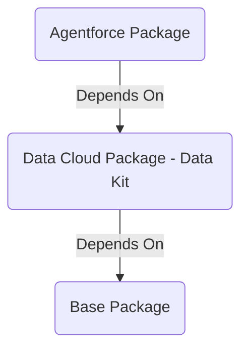

# TDX 25 - Building with Agentforce & Data Cloud: A Framework for ISVs

- [TDX 25 - Building with Agentforce \& Data Cloud: A Framework for ISVs](#tdx-25---building-with-agentforce--data-cloud-a-framework-for-isvs)
  - [What's Here](#whats-here)
  - [Package Organization](#package-organization)
    - [Base App (force-app)](#base-app-force-app)
    - [Data Cloud Data Kit (data-app)](#data-cloud-data-kit-data-app)
    - [Agentforce App (ai-app)](#agentforce-app-ai-app)
  - [Installation](#installation)
    - [Pre-requisites](#pre-requisites)
    - [Steps](#steps)
      - [Install base application](#install-base-application)
        - [Import Property Manager Data](#import-property-manager-data)
      - [Setup S3](#setup-s3)
        - [Insert Data into S3](#insert-data-into-s3)
      - [Install Data Cloud Data Kit Package](#install-data-cloud-data-kit-package)
      - [Install Agentforce Package](#install-agentforce-package)
  - [Fork this Repo](#fork-this-repo)
  - [FAQ](#faq)
    - [How do I get scratch org access for Data Cloud](#how-do-i-get-scratch-org-access-for-data-cloud)

## What's Here

- post install script to handle DC perms for Salesforce connector
- appanalytics hooks to help you capture insights into prompt templates, flows, etc

## Package Organization



### Base App (force-app)

### Data Cloud Data Kit (data-app)

### Agentforce App (ai-app)

## Installation

### Pre-requisites

Information about acquiring appropriate environments is included below in [FAQ](#faq).

- [ ] Developer edition or scratch org with Data Cloud and Agentforce licenses. The included project-scratch-def.json contains all relevant features and settings.
- [ ] Turn on Einstein (Setup > Einstein Setup > Turn On Einstein)
- [ ] Ensure Data Cloud is provisioned (Setup > Data Cloud Home). You should have a Tenant Endpoint listed under Your Home Org Details.
- [ ] User should have the following permissions assigned:
  - [ ] Data Cloud Admin
  - [ ] Prompt Template Manager
- [ ] Ability to create an AWS S3 bucket

### Steps

Installation steps are provided for both CLI and UI users.

#### Install base application

`sf package install -p {}`

[https://login.salesforce.com/packagingSetupUI/ipLanding.app?apvId={}](https://login.salesforce.com/packagingSetupUI/ipLanding.app?apvId={})

Assign Property Manager Permission Set

`sf org assign permset -n Property_Manager_Admin`

Setup > Users > {pick your user} > Permission Set Assignments > Add Property Manager Admin > Save

##### Import Property Manager Data

`npm run insertPMData`

In the event that you need to erase data to start over, run `npm run deletePMData`.

#### Setup S3

Under normal circumstances, you would receive S3 credentials from the app creator to help you setup the connector. While we cannot publicly share the credentials for this example, you can create an S3 bucket and use it in place of the packaged connector.

- Create bucket
- Create User
- Attach policy directly (switch out `tdx25-agentforce-datacloud` for your own bucket name)

```json
{
  "Version": "2012-10-17",
  "Statement": [
    {
      "Sid": "",
      "Effect": "Deny",
      "Action": "s3:*",
      "Resource": "arn:aws:s3:::tdx25-agentforce-datacloud/*",
      "Condition": {
        "Bool": {
          "aws:SecureTransport": "false"
        }
      }
    },
    {
      "Effect": "Allow",
      "Action": [
        "s3:GetBucketLocation",
        "s3:ListBucket",
        "s3:GetObject*",
        "s3:PutObject*",
        "s3:GetObjectTagging",
        "s3:DeleteObject"
      ],
      "Resource": [
        "arn:aws:s3:::tdx25-agentforce-datacloud",
        "arn:aws:s3:::tdx25-agentforce-datacloud/*"
      ]
    }
  ]
}
```

- Once the policy is created, go back to your user creation tab, refresh list of policies, choose newly created policy
- Create Access Keys
  - Choose Other
  - Download access and secret

##### Insert Data into S3

`npm run generateS3Data`

Drag and drop appliance folders into root of your newly created S3 bucket. Once imported, S3 should look as follows:

```text
|_ dishwasher/
  |_ dishwasher_data_2025-02-25.csv
  |_ dishwasher_data_2025-02-26.csv
|_ hvac/
  |_ hvac_data_2025-02-25.csv
  |_ hvac_data_2025-02-26.csv
|_ refrigerator/
  |_ refrigerator_data_2025-02-25.csv
  |_ refrigerator_data_2025-02-26.csv
|_ washer/
  |_ washer_data_2025-02-25.csv
  |_ washer_data_2025-02-26.csv
```

#### Install Data Cloud Data Kit Package

`sf package install -p {}`

[https://login.salesforce.com/packagingSetupUI/ipLanding.app?apvId={}](https://login.salesforce.com/packagingSetupUI/ipLanding.app?apvId={})

Deploy S3 connector Data Kit

Setup > Data Kits > PropertyManagerS3Connector > Deploy Data Kit

Activate S3 Connector

Setup > Data Cloud > External Integrations > Other Connectors > edit PropertyManagerS3Connector

- Enter AWS Access Key
- Enter AWS Secret Access Key
- Enter S3 bucket name
- Test Connection
- Verify. This will activate the connector.

Deploy Data Streams

- Data Cloud > Data Stream > New > Installed Package
- Select all Data Streams in Property Manager bundle. Click Next
- Click through each data stream to validate the connector (it will change to a checkmark). Click Next
- Next
- Deploy

#### Install Agentforce Package

`sf package install -p {}`

[https://login.salesforce.com/packagingSetupUI/ipLanding.app?apvId={}](https://login.salesforce.com/packagingSetupUI/ipLanding.app?apvId={})

## Fork this Repo

This project is meant to be forked and serves as a jumping off point for future Data Cloud + Agentforce projects. To quickly get up and running, execute `npm run renamespace` to replace existing namespace references to one that you can access. The namespace for this project is `mvpbo2`.

## FAQ

### How do I get scratch org access for Data Cloud

**Note:** This is a partner-only feature.

To have Scratch orgs enabled with Data Cloud, please submit a case to have the feature enabled in your DevHub org (Typically your Partner Business Org). Please note, Data Cloud licenses will not appear in your PBO, instead, you will be able to create scratch orgs with Data Cloud enabled.

> **Case Details**
>
> _Product_: Partner Programs & Benefits
>
> _Topic_: License Request - Prod Org
>
> _Subject_: “Enable Data Cloud for Scratch orgs in dev hub”
>
> _Body_: “Please enable Data Cloud Scratch Org permissions on my Partner Business Org, OrgId: XXX.”

Once submitted, permissions will be granted to your org within 3-5 business days.
