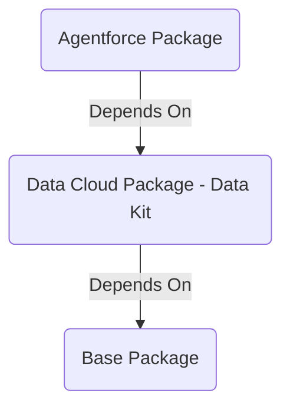

# TDX 25 - Building with Agentforce & Data Cloud: A Framework for ISVs

- [TDX 25 - Building with Agentforce \& Data Cloud: A Framework for ISVs](#tdx-25---building-with-agentforce--data-cloud-a-framework-for-isvs)
  - [What's Here](#whats-here)
  - [Package Organization](#package-organization)
    - [Base App (force-app)](#base-app-force-app)
    - [Data Cloud Data Kit (data-app)](#data-cloud-data-kit-data-app)
    - [Agentforce App (agentforce-app)](#agentforce-app-agentforce-app)
  - [Install Packages](#install-packages)
  - [Import Data](#import-data)
  - [Fork this Repo](#fork-this-repo)
  - [Setup your own S3 connection](#setup-your-own-s3-connection)

## What's Here

- post install script to handle DC perms for Salesforce connector
- appanalytics hooks to help you capture insights into prompt templates, flows, etc

## Package Organization



### Base App (force-app)

### Data Cloud Data Kit (data-app)

### Agentforce App (agentforce-app)

## Install Packages

- Install base app
- Install data Cloud kits
  - Deploy S3 connector Data Kit
    - Go to Setup > Connectors > edit PropertyManagerS3Connector > add credentials > verify. This will activate the connector.
  - Deploy Data Streams
    - Data Cloud > Data Stream > New > Installed Package
    - Select all Data Streams in bundle. Click Next
    - Click through each data stream to validate the connector. Click Next
    - Next
    - Deploy

## Import Data

`npm run insertCRMData`

## Fork this Repo

This project is meant to be forked and serves as a jumping off point for future Data Cloud + Agentforce projects. To quickly get up and running, execute `npm run renamespace` to replace existing namespace references to one that you can access.

## Setup your own S3 connection

repo users have the option of creating their own S3 connection and uploading data there.

- Create bucket
- Create User
- Attach policy directly (switch out tdx25-agentforce-datacloud for your own bucket name)

```json
{
  "Version": "2012-10-17",
  "Statement": [
    {
      "Sid": "",
      "Effect": "Deny",
      "Action": "s3:*",
      "Resource": "arn:aws:s3:::tdx25-agentforce-datacloud/*",
      "Condition": {
        "Bool": {
          "aws:SecureTransport": "false"
        }
      }
    },
    {
      "Effect": "Allow",
      "Action": [
        "s3:GetBucketLocation",
        "s3:ListBucket",
        "s3:GetObject*",
        "s3:PutObject*",
        "s3:GetObjectTagging",
        "s3:DeleteObject"
      ],
      "Resource": [
        "arn:aws:s3:::tdx25-agentforce-datacloud",
        "arn:aws:s3:::tdx25-agentforce-datacloud/*"
      ]
    }
  ]
}
```

- Once the policy is created, go back to your user creation tab, refresh list of policies, choose newly created policy
- Create Access Keys
  - Choose Other
  - Download access and secret


